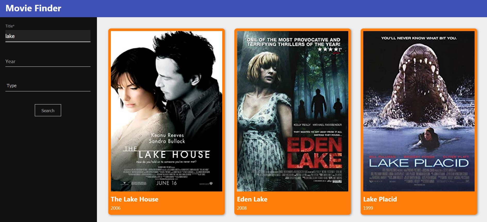
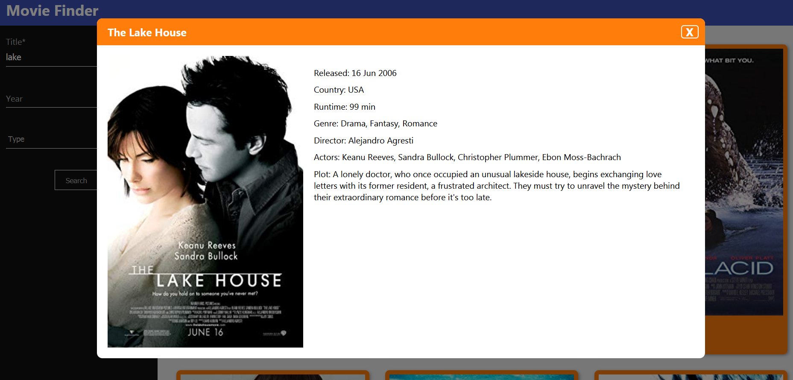

# Movie Finder

Web application allowing users to find information about their favourite movies.

## Table of contents

* [General info](#general-info)
* [How to start](#how-to-start)
* [Technologies](#technologies)
* [Screenshots](#screenshots)

## General info

Movie Finder allows you to find info about your favourite movie.

## How to start

```bash
git clone https://github.com/ljurak/movie-finder.git
cd movie-finder
npm install
npm start
```
The app will start on http://localhost:3000

## Technologies

Project is created with:
* JavaScript
* ReactJS
* HTML5
* CSS3

## Screenshots


Main page


Movie info
